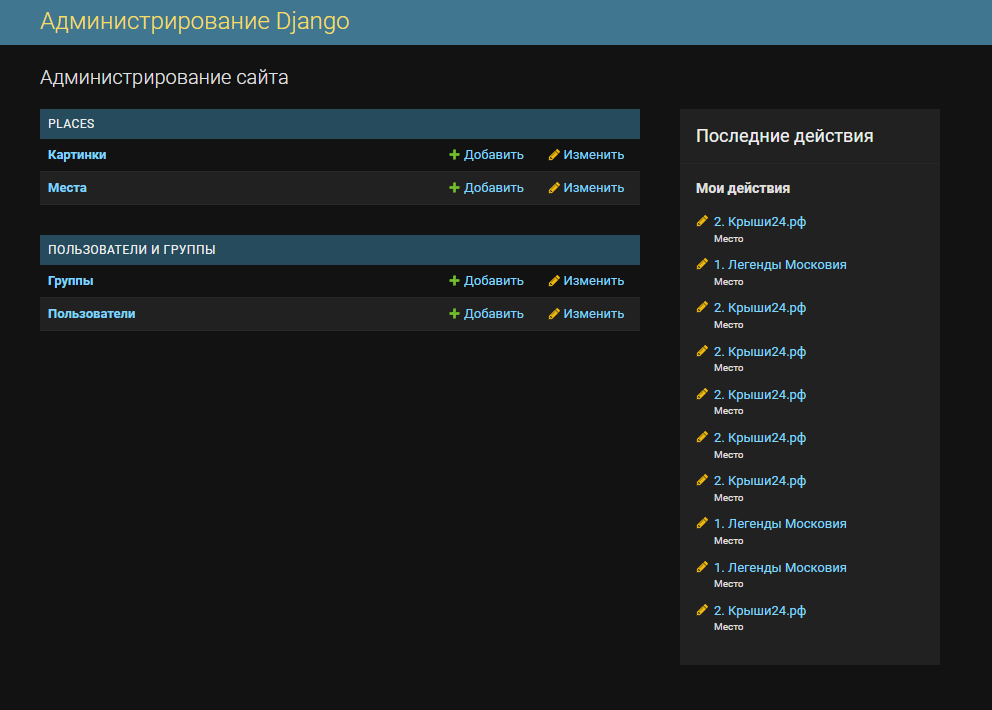
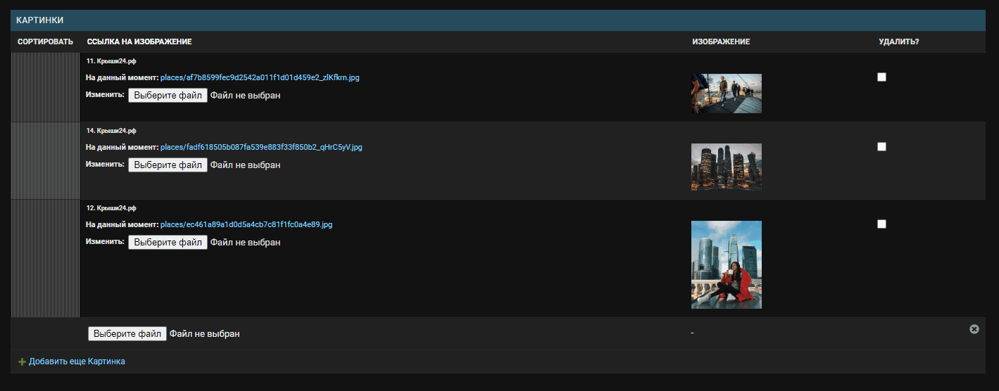

# Афиша интересных мест Москвы
Сайт с интересными местами Москвы на подобии "Яндекс афиша"
___
## Установка
- На компьютере должен быть установлен [Python 3.10+](https://www.python.org).
- Установите виртуальное [окружение](https://docs.python.org/3/tutorial/venv.html).
- В корневой папке проекта создайте файл `.env` со следующими переменными:  
```bash 
DJANGO_API_KEY=<DJANGO_API_KEY>
DJANGO_DEBUG=True
```
`DJANGO_API_KEY` генерируем [тут](https://djecrety.ir/)  
При установке `DJANGO_DEBUG=False`, в административной панели будет видна только вкладка `"Места"`. 
- Установите зависимости командой:
``` bash
pip install -r requirements.txt
```
- Обновите базу данных:
``` bash
python manage.py migrate
```
- Запусти локальный сервер: 
``` bash
python manage.py runserver
```
___
## Локальный сайт
Перейдите на [главную страницу сайта](http://127.0.0.1:8000/)


## Панель администратора
Для добавления новых локаций можно воспользоваться [панелью администратора](http://127.0.0.1:8000/admin/)


После прохождения авторизации, новые локации можно добавить во вкладке `Места`, нажав на кнопку `Добавить место`, справа вверху. 


После добавления данных, информация отобразится на карте.
Порядок картинок можно менять, перетаскивая их выше или ниже:  

После внесения всех изменений, не забудь нажать на кнопку `Сохранить`.


